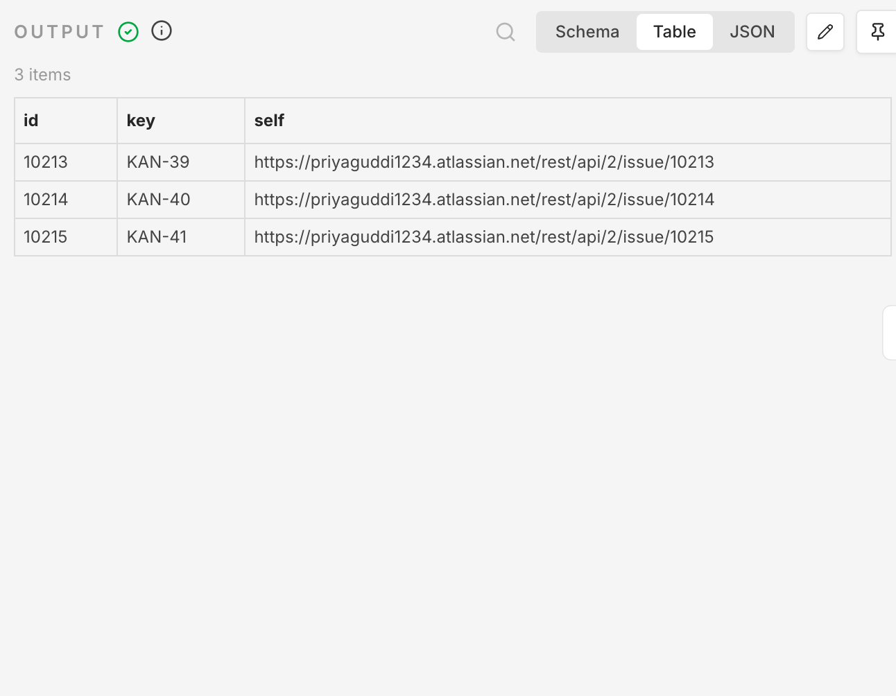

# 🤖 AI Telecom Network Health Monitor

An AI-powered Network Monitoring and Incident Management workflow built using **n8n, Gemini AI, and Jira**

The workflow analyzes router health metrics, detects network issues, generates AI-based root cause analysis, and automatically creates Jira tickets for critical incidents.

---

## 🏗️ Workflow Architecture

The complete n8n workflow:

---

## ⚙️ Workflow Execution Output

The AI agent analyzes network parameters like:

- BGP Status
- Interface Status
- CPU Usage
- Memory Usage
- Packet Loss

Execution result:

---

## 🎫 Automated Jira Ticket Creation

Critical network issues automatically create Jira incidents with:

- Issue Summary
- Description
- Severity
- Root Cause Analysis
- Recommended Actions

Jira tickets generated:

---

## 🛠️ Technologies Used

- n8n Workflow Automation
- Google Gemini AI
- Jira REST API
- JSON Data Processing
- Network Monitoring Concepts
- BGP & Interface Health Analysis

---

## 🚀 Features

✅ Automated network health analysis  
✅ AI-based troubleshooting recommendations  
✅ Critical issue detection  
✅ Automatic Jira incident creation  
✅ Reduced manual monitoring effort  

---

## 📌 Sample Network Issues Detected

Example:

Device: Router-R1
BGP Status: DOWN
Interface Status: DOWN
CPU Usage: 95%
Memory Usage: 80%
Packet Loss: 10%

Severity: Critical

Root Cause:
Total connectivity loss due to BGP and interface failure.

Action:
Inspect logs, check processes, and restore connectivity.

---

## 📈 Future Enhancements

- Real-time SNMP monitoring
- Slack/Teams alert integration
- Dashboard visualization
- Automated network remediation

